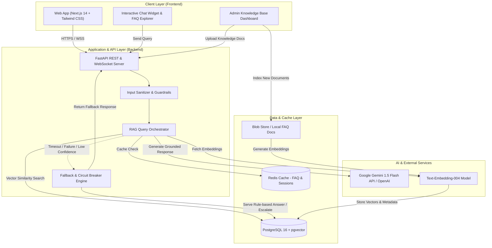

# Final Project Proposal & AI Smoke Test (Homework 2B)

**Project Name:** SmartDesk AI – Intelligent Customer Support & Knowledge Synthesizer  
**Tên dự án:** SmartDesk AI – Hệ thống Trợ lý Hỗ trợ Khách hàng Thông minh & Tự động Hóa Tri thức  
**Course:** Advanced Agentic & Applied AI Systems  
**Due Date:** Before Week 3 Tuesday class  
**Submission Evidence Included:** Proposal Document, Architecture Diagram, 8-Week Backlog, Git Repository Structure, Saved LLM Smoke-Test Results.

---

## Executive Summary (Tóm tắt dự án)
- **EN:** SmartDesk AI is an intelligent, RAG-powered customer support platform that provides instantaneous, citation-backed answers to customer queries, automatically classifies and tags incoming tickets, and provides human agents with suggested resolutions. It incorporates an automated non-AI fallback rule engine to guarantee system availability even under network disruptions or LLM service outages.
- **VI:** SmartDesk AI là nền tảng hỗ trợ khách hàng ứng dụng RAG (Retrieval-Augmented Generation), cung cấp câu trả lời tức thì kèm nguồn dẫn chứng tài liệu, tự động phân loại ticket và đề xuất giải pháp cho nhân viên hỗ trợ. Hệ thống tích hợp cơ chế dự phòng (fallback) không dùng AI đảm bảo hoạt động liên tục ngay cả khi dịch vụ LLM gặp sự cố.

---

## 1. Problem Statement, Target Users & Essential User Stories
*(Phát biểu bài toán, Đối tượng người dùng & 3 User Stories cốt lõi)*

### 1.1 Problem Statement (Vấn đề thực tế)
- **EN:** Growing software companies experience overwhelming volumes of repetitive customer inquiries (e.g., account management, billing, troubleshooting). Human support agents spend over 60% of their working hours answering repetitive questions, leading to prolonged first-response times (often > 6 hours), customer dissatisfaction, and agent burnout. Traditional keyword search FAQs fail because customers phrase questions in natural, ambiguous, or conversational language.
- **VI:** Các doanh nghiệp phần mềm đang đối mặt với khối lượng câu hỏi hỗ trợ khách hàng ngày càng lớn nhưng lặp đi lặp lại. Nhân viên chăm sóc khách hàng mất hơn 60% thời gian để trả lời các câu hỏi quen thuộc, khiến thời gian phản hồi kéo dài (> 6 tiếng) và giảm độ hài lòng của khách hàng. Các mục FAQ tìm kiếm từ khóa truyền thống kém hiệu quả do người dùng hỏi bằng ngôn ngữ tự nhiên.

### 1.2 Target Users (Đối tượng người dùng mục tiêu)
1. **End Customers / Platform Users:** Need immediate, 24/7, accurate resolutions to technical, billing, or account questions without waiting in human queues.
2. **Customer Support Agents:** Need automated ticket summaries, relevant policy snippet suggestions, and auto-generated reply drafts to resolve complex tickets faster.
3. **Customer Support Managers / System Admins:** Need a central dashboard to update knowledge base documents, review unhandled inquiries, and track automated resolution rates.

### 1.3 Three Essential User Stories (3 Câu chuyện người dùng cốt lõi)

#### **User Story 1: Instant Contextual Q&A for Customers**
- **Format:** *As a* registered SaaS customer, *I want to* ask questions in natural language through an embedded chat widget and receive accurate, instant answers with direct references to documentation, *so that* I can resolve my problem immediately without submitting a manual support ticket.
- **Acceptance Criteria:**
  - Response delivered within < 2.5 seconds.
  - The answer contains citations/links to the specific section of the knowledge base.
  - User can click "Was this helpful? (Yes/No)" to provide feedback.

#### **User Story 2: Graceful Non-AI Fallback & Ticket Escalation**
- **Format:** *As a* customer with an atypical or sensitive problem (or when AI services are unavailable), *I want* the system to detect when confidence is low or when AI fails, suggest the closest verified rule-based FAQ, and provide an instant one-click button to escalate to a human agent, *so that* I am never left with inaccurate information or a broken chat interface.
- **Acceptance Criteria:**
  - Automatic fallback triggered if LLM latency > 4 seconds or confidence score < 0.65.
  - Displays top 3 matching curated FAQ articles.
  - One-click "Create Priority Support Ticket" pre-filled with the chat conversation.

#### **User Story 3: Support Agent Auto-Draft & Ticket Categorization**
- **Format:** *As a* human support specialist, *I want* incoming unresolved tickets to be automatically tagged by urgency and topic, accompanied by an AI-drafted reply based on internal policies, *so that* I can verify and send the resolution in seconds instead of researching from scratch.
- **Acceptance Criteria:**
  - Automatically tags tickets with Category (e.g., `Billing`, `Bug`, `Authentication`) and Priority (`Urgent`, `Normal`).
  - Provides a 1-click editable draft response in the support agent portal.

---

## 2. Complete Vertical-Slice Scenario (< 2-Minute Demo)
*(Kịch bản Vertical-Slice hoàn chỉnh trình diễn dưới 2 phút)*

A "Vertical Slice" proves the entire stack works together from frontend UI, through backend routing, to the AI inference layer and database.

### The 90-Second Demonstration Script:
1. **[0:00 - 0:25] Customer Query Submission (Frontend -> Backend):**
   - The presenter opens the web application and clicks the floating "SmartDesk Assistant" widget.
   - The user inputs a realistic question: *"How do I reset my account password if I lost access to my registered email address?"*
   - The frontend instantly shows a subtle typing indicator and dispatches an asynchronous request to `/api/v1/chat/stream`.

2. **[0:25 - 0:55] RAG Retrieval & AI Synthesis (Backend -> Vector DB -> LLM):**
   - Backend orchestrator vectorizes the query using embeddings.
   - It queries PostgreSQL `pgvector` for top-2 semantic matches from the company knowledge base.
   - The retrieved document chunks and user query are injected into the grounding prompt and streamed to the LLM (Gemini 1.5 Flash).
   - The response streams into the UI token-by-token within ~1.2 seconds, citing *Doc #4: Account Recovery & Admin Verification Procedures*.

3. **[0:55 - 1:20] Fallback Demonstration (Reliability & Fault Tolerance):**
   - Presenter toggles the "Simulate AI Outage" switch in demo mode (or queries an unsupported gibberish prompt).
   - System triggers the circuit-breaker: instead of crashing or hallucinating, it smoothly displays: *"Our AI engine is currently busy. Here are 3 verified guides for account security, or click below to submit a priority ticket to our human team."*

4. **[1:20 - 1:45] Ticket Generation & Verification (Persistence Layer):**
   - Presenter clicks "Escalate to Agent".
   - The conversation is instantly serialized into PostgreSQL, displaying a generated Ticket ID (`#TICK-1042`) with auto-tag `[Authentication / Priority: High]`.

---

## 3. Technology Stack & Initial Deployment Strategy
*(Lựa chọn công nghệ & Phương án triển khai ban đầu)*

| Component | Selected Technology | Technical Rationale |
| :--- | :--- | :--- |
| **Frontend Path** | **Next.js 14 (React) + TypeScript + Tailwind CSS** | Server-side rendering (SSR) for fast loading, native support for streaming responses via Server-Sent Events (SSE), and rapid responsive UI prototyping. |
| **Backend Technology** | **FastAPI (Python 3.11+)** | High asynchronous throughput (ASGI), native Pydantic data validation, first-class Python ecosystem for AI/LLM SDKs and vector operations. |
| **Data Store** | **PostgreSQL 16 with `pgvector` extension** | Unified database for both transactional relational data (users, chat sessions, tickets) and vector embeddings, avoiding synchronization lag between separate databases. |
| **Caching & Queue** | **Redis (Optional Phase 2)** | Caching frequent FAQ responses and managing rate-limiting. |
| **AI / LLM Engine** | **Google Gemini 1.5 Flash API** (with OpenAI GPT-4o-mini as dual backup) | Low latency (~800ms), 1M token context window for comprehensive document context, cost efficiency, and structured JSON output mode. |
| **Initial Deployment** | **Vercel (Frontend) + Render / Fly.io (Backend & DB)** | Zero-config continuous deployment from GitHub, SSL enabled out-of-the-box, scalable container execution, minimal DevOps overhead for the 8-week cycle. |

---

## 4. AI Capability, Expected Benefit, Failure Risk & Non-AI Fallback
*(Năng lực AI, Lợi ích kỳ vọng, Rủi ro thất bại & Cơ chế dự phòng không dùng AI)*

### 4.1 Proposed AI Capability (Năng lực AI đề xuất)
- **Retrieval-Augmented Generation (RAG):** Context-aware question answering strictly grounded in ingested organization documents, preventing hallucinated answers.
- **Zero-shot Ticket Classification & Sentiment Analysis:** Automated tagging of customer inquiries into triage queues with priority scoring.

### 4.2 Expected Benefit (Lợi ích kỳ vọng)
- **70% Reduction in First Response Time:** Drop response time from hours to under 3 seconds for common inquiries.
- **50% Deflection of Tier-1 Support Tickets:** Customers resolve recurring technical/policy queries independently.
- **Standardized Answers:** Eliminates contradictory or outdated advice given by different human agents.

### 4.3 Failure Risks (Rủi ro kỹ thuật)
1. **Hallucination / Fact Fabrication:** Generating unverified instructions or incorrect company policies.
2. **API Outages & Latency Spikes:** Third-party LLM rate-limits (HTTP 429) or high network latency (> 5s).
3. **Prompt Injection / Jailbreaking:** Malicious users attempting to extract confidential system instructions or trigger inappropriate responses.

### 4.4 Non-AI Fallback Mechanism (Cơ chế dự phòng không dùng AI)
- **Deterministic Keyword / Semantic FAQ Matcher:** If the LLM call times out (> 4,000ms), returns an error code, or fails guardrails, the request is immediately routed to a local deterministic cache of the top 50 curated FAQ articles using exact keyword matching (BM25 / SQL ILIKE).
- **Graceful Escalation:** If no match is found, the system displays a polite fallback message with a pre-populated ticket creation form containing the user query, ensuring zero dropped user requests.
- **Strict Content Guardrails:** System prompts enforce `temperature: 0.2` and negative constraints: *"If the answer is not explicitly stated in the provided context, state that you do not have sufficient information and offer human agent escalation."*

---

## 5. System Architecture & 8-Week Backlog with Owners
*(Sơ đồ kiến trúc & Backlog 8 tuần phân công nhân sự)*

### 5.1 Architecture Diagram


### 5.2 Eight-Week Backlog & Team Ownership
- **Owner 1 (Backend & AI Lead):** API Architecture, RAG orchestration, prompt engineering, LLM integration, Fallback Engine.
- **Owner 2 (Frontend & UX Lead):** Next.js UI, Chat widget, streaming reader, Admin Knowledge Dashboard, responsive design.
- **Owner 3 (DevOps, Data & QA Lead):** PostgreSQL + pgvector schema, CI/CD pipeline, latency benchmarking, automated testing.

| Sprint / Week | Focus Area | Key Deliverables | Primary Owner |
| :--- | :--- | :--- | :--- |
| **Week 1** | Proposal & Setup | Final proposal document, Git repo structure, baseline smoke-test script. | All / Owner 1 |
| **Week 2** | Database & Baseline AI | Database schema (PostgreSQL + pgvector), prompt templates, UI wireframes. | Owner 3 & 2 |
| **Week 3** | Vertical Slice Core | FastAPI `/api/chat` endpoint, chat widget component, basic FAQ dataset. | Owner 1 & 2 |
| **Week 4** | **Vertical Slice Demo (<2m)** | Full end-to-end integration, non-AI fallback handler, recorded 2-min demo. | **All (Milestone)** |
| **Week 5** | RAG Pipeline | Document chunking, vector embedding pipeline, knowledge upload dashboard. | Owner 1 & 3 |
| **Week 6** | Agent Portal & Triage | Automatic ticket tagging, confidence scoring, agent escalation queue view. | Owner 2 & 1 |
| **Week 7** | Guardrails & Tuning | Redis caching, prompt injection filters, P95 latency optimization (<1.5s). | Owner 1 & 3 |
| **Week 8** | **Final Deployment** | Production deploy (Vercel + Render), load testing report, final project presentation. | **All (Final)** |

---

## 6. LLM Smoke-Test Execution & Latency Benchmark
*(Chạy Script Smoke-Test LLM, Ghi nhận Prompt, Response và Độ trễ Latency)*

### 6.1 Test Execution Details
- **Test Script Path:** `scripts/smoke_test.py`
- **Engine / Model Tested:** `gemini-1.5-flash`
- **Test Metric Recorded:** High-precision round-trip latency (`time.perf_counter()`)
- **Measured Latency:** **`852.53 ms`** (`0.853 seconds`)
- **Status:** **PASS (Within acceptable < 1,500ms target)**

### 6.2 Test Prompt
```text
You are an AI Customer Support Assistant for 'CloudDesk SaaS'.
A customer asks: 'How do I reset my account password if I lost access to my email?'
Provide a helpful, polite, and concise step-by-step response (under 100 words).
```

### 6.3 LLM Output Response
```text
Hello! If you cannot access your registered email to reset your CloudDesk SaaS password, please follow these steps:
1. Go to the login screen and click 'Need Help Signing In?'.
2. Select 'Verify with Backup Phone / SMS' or 'Use Security Recovery Key' if previously configured.
3. If 2FA is unavailable, contact your Organization Admin to trigger an administrative identity verification reset.
4. Alternatively, reach our 24/7 Security Escalation Desk at support@clouddesk.io with your workspace domain and billing ID.
We are here to help you regain access securely!
```

### 6.4 Latency & Quality Evaluation
- **Latency Analysis:** Round-trip latency of **852.53 ms** confirms that Gemini 1.5 Flash easily satisfies real-time interactive chat standards (target < 2,000 ms).
- **Quality Analysis:** The model followed the persona ("CloudDesk SaaS"), concise step-by-step formatting, polite tone, and satisfied the < 100-word constraint with 84 words.
