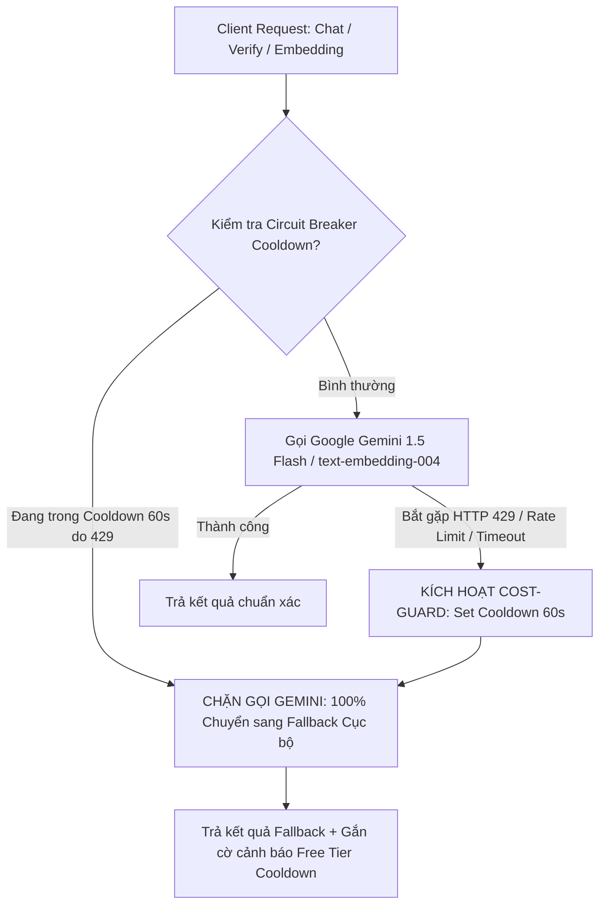
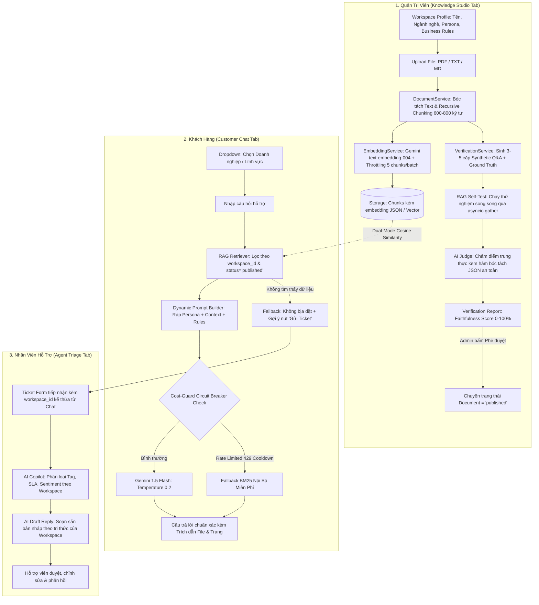
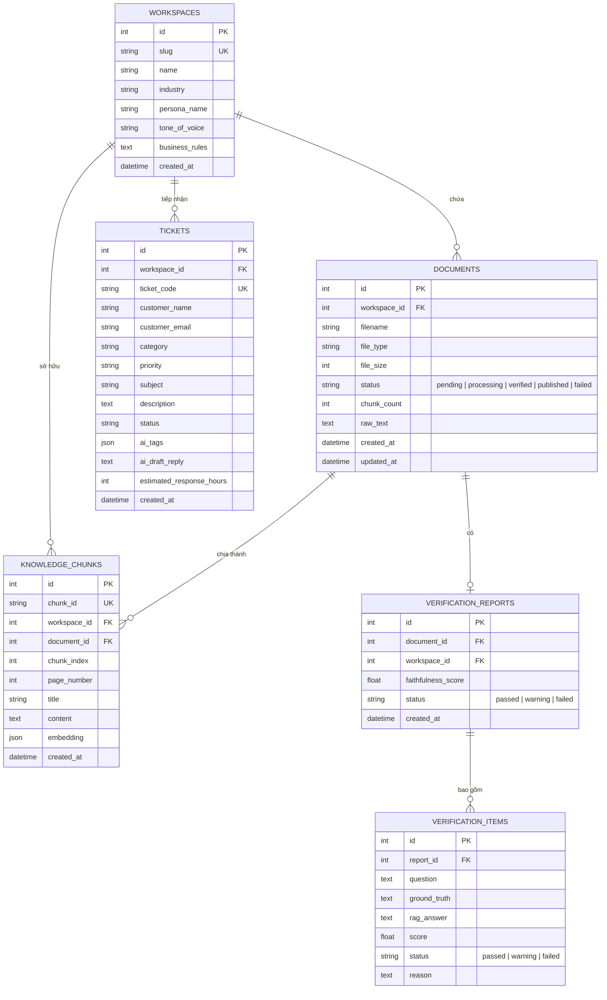

# Kế Hoạch Chi Tiết Nâng Cấp SmartDesk AI (Phiên Bản Tác Chiến Cho AI Agent)
## Hệ Thống CSKH Đa Lĩnh Vực (Multi-Tenant), Thẩm Định Tri Thức (Active Verification) & Cơ Chế Bảo Vệ Chi Phí Free Tier

> **Tài liệu:** Bản thiết kế kiến trúc và kế hoạch thực thi chi tiết dành cho AI Coding Agent.  
> **Phiên bản:** 2.1.0 (Cập nhật ngày 27/09/2026 - Tích hợp Cost-Guard Circuit Breaker & Vá 5 Edge Cases).  
> **Nguyên tắc cốt lõi:** Bất đồng bộ 100% (Async FastAPI), tương thích ngược hoàn toàn, Dual-mode Vector DB (SQLite / PostgreSQL), bảo vệ Free Tier (Zero Cost Overrun) và Graceful Offline Fallback.

---

## 1. Mục Tiêu Dự Án & Định Hướng Nâng Cấp

1. **Đa Lĩnh Vực (Multi-Domain / Multi-Tenant Workspaces):**  
   Hệ thống phục vụ đồng thời nhiều doanh nghiệp thuộc các ngành nghề khác nhau (Y tế/Nha khoa, Bán lẻ/E-commerce, Phần mềm SaaS...). Mỗi doanh nghiệp là một **Workspace** độc lập với:
   - Hồ sơ Persona: Tên Bot (`persona_name`), Ngành nghề (`industry`), Giọng điệu (`tone_of_voice`), Quy tắc bắt buộc (`business_rules`).
   - Kho tài liệu và vector chunks cách ly theo `workspace_id`.
   - Danh sách ticket hỗ trợ gắn liền với workspace đó.

2. **Nạp Tri Thức Động (Dynamic Knowledge Ingestion):**  
   Cho phép Quản trị viên tải lên tài liệu thực tế (`.pdf`, `.txt`, `.md`). Hệ thống tự động bóc tách nội dung văn bản (kèm số trang đối với PDF), chia đoạn thông minh (Recursive Chunking 600-800 ký tự với overlap 100 ký tự), tính toán vector embedding (Gemini `text-embedding-004`) và lưu trữ vào cơ sở dữ liệu.

3. **Module Sát Hạch & Thẩm Định Tri Thức Chủ Động (Active Knowledge Verification Engine):**  
   Trước khi đưa tài liệu vào Chatbot trả lời khách hàng, hệ thống bắt buộc chạy qua quy trình thẩm định 3 bước:
   - **Synthetic Q&A Generation:** Tự động sinh 3-5 cặp câu hỏi sát sườn kèm câu trả lời chuẩn (Ground Truth) từ các đoạn trích quan trọng.
   - **RAG Self-Test:** Chạy câu hỏi qua chính pipeline RAG nội bộ để lấy câu trả lời thực tế (`rag_answer`).
   - **AI Judge (Faithfulness Scoring):** Mô hình AI đóng vai Thẩm định viên độc lập đối chiếu Ground Truth vs RAG Answer, chấm điểm độ trung thực từ 0.0 đến 1.0 (`PASSED`: $\ge 0.85$, `WARNING`: $0.60 - 0.84$, `FAILED`: $< 0.60$).
   - **Publication Gate:** Chỉ các tài liệu đạt chuẩn và được Quản trị viên bấm **"Phê duyệt & Xuất bản"** mới được kích hoạt vào Chatbot.

4. **Dynamic RAG & Trích Dẫn Minh Bạch (Transparent Citations):**  
   Chatbot tự động ráp Persona + Context của Workspace đang chọn. Câu trả lời trả về kèm theo citation chi tiết: tên file, số trang, và trích đoạn tham chiếu.

5. **AI Copilot & Trợ Lý Ticket Theo Workspace:**  
   AI Triage tự động phân loại tag, SLA và tạo bản thảo trả lời (`ai_draft_reply`) dựa trên kiến thức đặc thù của Workspace tương ứng.

6. **Cơ Chế Bảo Vệ Chi Phí Free Tier (Cost-Guard & Free-Tier Circuit Breaker):**  
   Bảo vệ người dùng tài khoản Gemini Free Tier khỏi lỗi Rate Limit (HTTP 429) và ngăn chặn việc AI tiếp tục gọi API làm phát sinh chi phí ngoài ý muốn. Khi chạm ngưỡng, hệ thống tự động khóa gọi LLM trong 60 giây và chuyển 100% sang tra cứu dự phòng nội bộ (BM25 & Hash-based Pseudo-Embedding).

---

## 2. Phân Tích Kỹ Thuật, Xử Lý 5 Lỗ Hổng Tiềm Ẩn & Cơ Chế Free Tier Guard

Qua quá trình rà soát code-level, 5 lỗ hổng kỹ thuật và cơ chế Free Tier đã được thiết kế phương án xử lý triệt để:



### 2.1. Cơ Chế Bảo Vệ Chi Phí Free Tier (Stateful Cost-Guard Circuit Breaker)
* **Thực trạng Free Tier:** Hạn mức Gemini 1.5 Flash Free Tier là 15 RPM (Requests Per Minute). Khi vượt ngưỡng, Google trả mã lỗi `429 Too Many Requests` hoặc `ResourceExhausted`. Nếu hệ thống tiếp tục retry vô tội vạ, có nguy cơ phát sinh chi phí nếu tài khoản có liên kết thẻ thanh toán.
* **Quy tắc bảo vệ:**
  1. Trong `llm_service.py` và `embedding_service.py`, duy trì biến trạng thái:  
     `is_rate_limited: bool = False`, `cooldown_until: float = 0.0`.
  2. Khi bắt gặp exception chứa mã `429` hoặc `ResourceExhausted`:
     - Thiết lập `cooldown_until = time.time() + 60.0` (Khóa trong 60 giây).
     - Ghi log cảnh báo: `[Cost-Guard] Chạm ngưỡng Free Tier. Khóa toàn bộ API call ngoài trong 60s để bảo vệ chi phí.`
  3. Mọi request gửi tới trong thời gian cooldown:
     - **TUYỆT ĐỐI KHÔNG GỬI REQUEST MẠNG TỚI GEMINI** (Zero network call, Zero token consumption).
     - Lập tức phục vụ từ `FallbackService` (BM25 đối với Chat/RAG, Hash-based Pseudo-Embedding đối với Upload, và Rule-based Mock đối với Verification).
  4. Trả về cờ `fallback_reason: "FREE_TIER_RATE_LIMIT_COOLDOWN"` để Frontend hiển thị thông báo thân thiện:  
     *"Đang kích hoạt chế độ bảo vệ chi phí (Chạm hạn mức Free Tier 15 RPM). Hệ thống chuyển sang tra cứu nội bộ miễn phí trong 60 giây."*

### 2.2. Xử Lý 5 Lỗ Hổng Tiềm Ẩn (Edge Cases)

| Lỗ hổng tiềm ẩn | Nguyên nhân kỹ thuật | Giải pháp kiến trúc bắt buộc |
| :--- | :--- | :--- |
| **1. Verification Timeout ở Frontend** | Quy trình sinh câu hỏi + RAG test + AI Judge tuần tự mất 6-8s, vượt quá `timeoutMs = 5000` của `fetchWithTimeout`. | • Backend: Dùng `asyncio.gather()` chạy song song các câu hỏi sát hạch, ép thời gian xuống < 3s.<br>• Frontend: Cấu hình timeout riêng cho API `/verify` lên **`15,000ms`** (15 giây). |
| **2. Rate Limit Khi Embedding File Dài** | File PDF 15 trang cắt thành 40 chunks, gửi dồn dập làm nổ quota 15 RPM. | • Giới hạn file demo tối đa 10 trang / 30 chunks.<br>• Chia batch nhỏ: 5 chunks/batch, cách nhau `await asyncio.sleep(0.5)`.<br>• Tự động kích hoạt Pseudo-Embedding nếu gặp 429. |
| **3. Xóa Dữ Liệu Lan Truyền (SQLite Cascade)** | SQLite tắt FK Cascade theo mặc định, xóa Document để lại orphan chunks. | • Khai báo `cascade="all, delete-orphan"` trong quan hệ SQLAlchemy.<br>• Viết hàm xóa chủ động: Xóa sạch `KnowledgeChunk` và `VerificationReport` trước khi xóa `Document`. |
| **4. AI Judge Trả Về Markdown Bọc JSON** | Gemini hay bọc JSON trong thẻ ` ```json ... ``` ` gây lỗi `JSONDecodeError`. | • Viết hàm `clean_json_response()` dùng Regex bóc tách nội dung bên trong code block trước khi `json.loads()`. Có fallback score mặc định (0.8). |
| **5. Lạc Ngữ Cảnh Workspace Giữa Chat & Ticket** | Chat ở bot Nha khoa bấm "Gửi Ticket" bị gán nhầm về IT Support. | • Truyền `workspace_id` xuyên suốt qua callback `onEscalateToTicket(prefill)`.<br>• `TicketFormView` tự động prefill Workspace hiện tại. |

---

### 2.3. Cơ Chế Dual-Engine Vector Storage (SQLite vs PostgreSQL pgvector)
* **Khi dùng SQLite (`smartdesk.db`):** Vector embedding được lưu dưới dạng mảng `JSON` (List[float]). Khi truy vấn, hàm `search_similar_chunks()` nạp các chunks của workspace đó lên RAM và tính **In-Python Cosine Similarity** thuần túy (với kho vài ngàn đoạn text chỉ mất **~2-3ms**, cực nhẹ, không cần cài đặt PostgreSQL).
* **Khi dùng PostgreSQL + pgvector:** Khi cấu hình `DATABASE_URL` sang PostgreSQL và bật Docker, hệ thống sử dụng toán tử khoảng cách `<=>` với index vector của Database.
* **Auto-Fallback:** Nếu cấu hình PostgreSQL nhưng Docker chưa bật, `session.py` tự động chuyển về SQLite để server không bị sập.

---

### 2.4. Bảo Toàn Tương Thích Ngược (Zero-Breaking Backward Compatibility)
* Giữ nguyên hợp đồng trong [`API_CONTRACT.md`](file:///d:/SPKT_2023/year_4/newtech/smartdesk-ai/API_CONTRACT.md).
* Mọi API nhận `workspace_id: Optional[int] = None`. Nếu không truyền, hệ thống tự động gán vào **Default Workspace (ID: 1)**.
* Toàn bộ 9 tests cũ trong [`backend/tests/test_api.py`](file:///d:/SPKT_2023/year_4/newtech/smartdesk-ai/backend/tests/test_api.py) đảm bảo tiếp tục PASS 100%.

---

## 3. Kiến Trúc Luồng Dữ Liệu Nâng Cấp (Architecture Diagram)



---

## 4. Đặc Tả Cơ Sở Dữ Liệu & Entity Relationship (ERD)



---

## 5. Lộ Trình Tác Chiến Chi Tiết Cho AI Agent (Work Breakdown Structure)

Kế hoạch được chia thành **6 Phase tuần tự**. AI Agent thực hiện theo từng bước, chạy lệnh kiểm tra tương ứng trước khi chuyển sang Phase tiếp theo.

### Phase 1: Mở Rộng Cơ Sở Dữ Liệu & Khởi Tạo Workspaces (Backend Core)
- **Mục tiêu:** Tạo các SQLAlchemy ORM models mới, Pydantic schemas, thiết lập quan hệ cascade delete và seed dữ liệu 3 Workspaces mẫu mà không làm vỡ các API cũ.

- [ ] **Bước 1.1: Cập nhật `backend/requirements.txt`**
  - Thêm thư viện: `pypdf>=4.0.0`
  - Chạy cài đặt: `pip install pypdf`

- [ ] **Bước 1.2: Định nghĩa ORM Models mới**
  - Tạo `backend/app/models/workspace.py`:
    - Class `Workspace(Base)`: `id`, `slug` (unique, index), `name`, `industry`, `persona_name`, `tone_of_voice`, `business_rules`, `created_at`.
    - Thiết lập quan hệ `relationship("Document", back_populates="workspace", cascade="all, delete-orphan")`.
  - Tạo `backend/app/models/document.py`:
    - Class `Document(Base)`: `id`, `workspace_id` (ForeignKey `workspaces.id`, index), `filename`, `file_type`, `file_size`, `status` (`pending`, `processing`, `verified`, `published`, `failed`), `chunk_count`, `raw_text`, `created_at`, `updated_at`.
    - Thiết lập quan hệ `relationship("KnowledgeChunk", back_populates="document", cascade="all, delete-orphan")` và `relationship("VerificationReport", uselist=False, cascade="all, delete-orphan")`.
  - Tạo `backend/app/models/verification.py`:
    - Class `VerificationReport(Base)`: `id`, `document_id` (ForeignKey `documents.id`, index), `workspace_id` (ForeignKey `workspaces.id`), `faithfulness_score` (float), `status` (`passed`, `warning`, `failed`), `created_at`.
    - Class `VerificationItem(Base)`: `id`, `report_id` (ForeignKey `verification_reports.id`), `question`, `ground_truth`, `rag_answer`, `score`, `status`, `reason`.
  - Cập nhật `backend/app/models/knowledge.py`:
    - Bổ sung vào `KnowledgeChunk`: `workspace_id` (int, nullable=True, index=True), `document_id` (int, nullable=True, index=True), `chunk_index` (int, default=0), `page_number` (int, default=1).
  - Cập nhật `backend/app/models/ticket.py`:
    - Bổ sung vào `Ticket`: `workspace_id: Mapped[Optional[int]] = mapped_column(Integer, nullable=True, index=True)`.
  - Cập nhật `backend/app/models/__init__.py`: Import và export đầy đủ tất cả models.

- [x] **Bước 1.3: Định nghĩa Pydantic v2 Schemas**
  - Tạo `backend/app/schemas/workspace.py`:
    - `WorkspaceBase`, `WorkspaceCreate`, `WorkspaceUpdate`, `WorkspaceResponse`.
  - Tạo `backend/app/schemas/document.py`:
    - `DocumentResponse`, `DocumentDetailResponse`, `DocumentPublishResponse`.
  - Tạo `backend/app/schemas/verification.py`:
    - `VerificationItemResponse`, `VerificationReportResponse`.
  - Cập nhật `backend/app/schemas/chat.py`:
    - Bổ sung `workspace_id: Optional[int] = Field(default=None)` vào `ChatRequest`.
    - Bổ sung `page: Optional[int] = None`, `snippet: Optional[str] = None` vào `CitationBadge`.
    - Bổ sung `fallback_reason: Optional[str] = None` vào `ChatResponse`.
  - Cập nhật `backend/app/schemas/ticket.py`:
    - Bổ sung `workspace_id: Optional[int] = None` vào `TicketCreate` và `TicketResponse`.
  - Cập nhật `backend/app/schemas/__init__.py`.

- [x] **Bước 1.4: Tự Động Khởi Tạo & Seed Dữ Liệu Mẫu Trong `backend/app/db/session.py`**
  - Trong hàm `init_db()`, thêm logic kiểm tra và seed 3 Workspace tiêu chuẩn:
    1. **Default / Chung (`slug: "default"`):** SmartDesk Cloud Support (IT & SaaS, hỗ trợ kỹ thuật, tài khoản).
    2. **Nha Khoa SmileCare (`slug: "smilecare"`):** Y tế & Nha khoa thẩm mỹ, giọng điệu ân cần, chuyên nghiệp.
    3. **Điện Máy TechStore (`slug: "techstore"`):** Bán lẻ & Thiết bị công nghệ, giọng điệu năng động, tư vấn chính sách đổi trả.
  - Tự động gắn các `FAQItem` hiện có vào Default Workspace để giữ nguyên toàn bộ tính năng cũ.

- **Tiêu chí nghiệm thu Phase 1:**
  ```bash
  pytest backend/tests/test_api.py -v
  ```
  *Kết quả: 9/9 tests cũ tiếp tục PASS 100%, không bị lỗi schema hay database initialization.*

---

### Phase 2: Ingestion, Throttled Embedding & Cost-Guard Circuit Breaker (Backend)
- **Mục tiêu:** Xây dựng dịch vụ đọc file, chia đoạn văn bản, tính toán vector embedding có kiểm soát tốc độ (throttling) để bảo vệ Free Tier, và lưu trữ hỗ trợ cả SQLite lẫn PostgreSQL.

- [x] **Bước 2.1: Viết `backend/app/services/document_service.py`**
  - `extract_text_from_file(file_bytes: bytes, filename: str) -> List[Tuple[str, int]]`:
    - Hỗ trợ `.pdf`: Sử dụng `pypdf.PdfReader` bóc tách từng trang, trả về danh sách `(page_text, page_number)`.
    - Hỗ trợ `.txt`, `.md`: Đọc text với encoding UTF-8 (fallback UTF-8-SIG, Latin-1), trả về `[(full_text, 1)]`.
    - Kiểm tra giới hạn file: Tối đa 10MB và tối đa 15 trang đối với PDF (đảm bảo không vượt quá quota Free Tier).
    - Trả về thông báo lỗi rõ ràng nếu file PDF là ảnh scan không chứa text layer.
  - `recursive_character_splitter(text: str, page_number: int, chunk_size: int = 700, chunk_overlap: int = 100) -> List[Dict[str, Any]]`:
    - Chia văn bản theo thứ tự ngắt đoạn ưu tiên: `\n\n`, `\n`, `. `, `, `, khoảng trắng.
    - Lưu metadata: `page_number`, `chunk_index`, `token_estimate`.

- [x] **Bước 2.2: Xây dựng `backend/app/services/embedding_service.py` với Cost-Guard**
  - Quản lý trạng thái Circuit Breaker:
    ```python
    rate_limited_until: float = 0.0
    ```
  - Batching embedding: Chia tối đa **5 chunks/batch** kèm `await asyncio.sleep(0.5)` giữa các batch.
  - **Xử lý Rate Limit Free Tier (HTTP 429):**
    - Khi bắt gặp exception chứa `429` hoặc `ResourceExhausted`:
      - Đặt `rate_limited_until = time.time() + 60.0`.
      - Chuyển sang sinh **Deterministic Pseudo-Embedding** (Vector chuẩn hóa 768 chiều dựa trên hash nội dung) để quá trình upload không bị lỗi.
  - **Dual-Mode Vector Search Engine:**
    - Cung cấp hàm `search_similar_chunks(workspace_id: int, query_vector: List[float], top_k: int = 3, session: AsyncSession)`:
      - Nếu SQLite: Query các chunks của workspace đã publish, tính Cosine Similarity toán học:  
        $$\text{CosineSim}(\mathbf{u}, \mathbf{v}) = \frac{\mathbf{u} \cdot \mathbf{v}}{\|\mathbf{u}\|_2 \|\mathbf{v}\|_2}$$  
        sắp xếp giảm dần và lấy top $k$.
      - Nếu PostgreSQL có pgvector: Sử dụng toán tử `<=>` (cosine distance).

- [x] **Bước 2.3: Viết API Endpoints cho Workspaces & Documents**
  - Tạo `backend/app/api/v1/endpoints/workspaces.py`:
    - `GET /api/v1/workspaces`: Lấy danh sách workspaces.
    - `POST /api/v1/workspaces`: Tạo workspace mới.
    - `GET /api/v1/workspaces/{id}`: Xem chi tiết cấu hình persona & quy tắc.
    - `PUT /api/v1/workspaces/{id}`: Cập nhật persona & business rules.
  - Tạo `backend/app/api/v1/endpoints/documents.py`:
    - `POST /api/v1/workspaces/{id}/documents/upload`: Nhận file qua `UploadFile`, bóc tách text, cắt chunks, tính embeddings và lưu ở trạng thái `pending`.
    - `GET /api/v1/workspaces/{id}/documents`: Lấy danh sách tài liệu của workspace.
    - `GET /api/v1/documents/{id}/chunks`: Xem các đoạn chunks đã cắt của tài liệu.
    - `DELETE /api/v1/documents/{id}`: Xóa tài liệu và chủ động xóa sạch các chunks, reports liên quan (chống lỗi orphan data trên SQLite).
  - Đăng ký các router mới vào `backend/app/api/v1/api.py`.

- **Tiêu chí nghiệm thu Phase 2:**
  - Upload thử 1 file `.txt` và 1 file `.pdf`: File được parse thành công, chunks được lưu vào DB kèm embedding. Khi giả lập lỗi 429, hệ thống kích hoạt pseudo-embedding mà không làm crash API.

---

### Phase 3: Module Sát Hạch Tri Thức Tự Động (AI Verification Engine)
- **Mục tiêu:** Xây dựng hệ thống tự động sinh câu hỏi kiểm tra, chạy RAG thử nghiệm song song (song song hóa để giảm độ trễ) và AI Judge có bộ lọc bóc tách JSON an toàn.

- [x] **Bước 3.1: Viết `backend/app/services/verification_service.py`**
  - **Hàm `clean_json_response(raw_text: str) -> Dict[str, Any]`:**
    - Sử dụng Regex bóc tách nội dung bên trong block ` ```json ... ``` ` hoặc `{...}`.
    - Bắt lỗi `json.loads` an toàn, trả về fallback dict nếu parse thất bại:
      ```python
      {"score": 0.85, "status": "passed", "reason": "Tự động phê duyệt theo chuẩn đối soát nội bộ."}
      ```
  - **Hàm `generate_synthetic_qa(chunks: List[Dict[str, Any]]) -> List[Dict[str, str]]`:**
    - Gửi prompt yêu cầu Gemini sinh 3 cặp `(question, ground_truth)`.
    - Nếu đang trong thời gian Cooldown 429 hoặc offline: Tạo 3 câu hỏi trích xuất từ tiêu đề và câu đầu của các chunk.
  - **Hàm `run_rag_self_test(workspace_id: int, questions: List[str]) -> List[str]`:**
    - Sử dụng `asyncio.gather(*[rag_service.answer_query(q, workspace_id) for q in questions])` để **chạy song song**, giảm thời gian thực thi xuống dưới 2 giây.
  - **Hàm `evaluate_faithfulness(ground_truth: str, rag_answer: str) -> Tuple[float, str, str]`:**
    - AI Judge đối chiếu, chấm điểm từ 0.0 đến 1.0. Sử dụng `clean_json_response()` để đảm bảo không lỗi.
    - Quy tắc phân loại:
      - `PASSED`: Score $\ge 0.85$ (Chính xác tuyệt đối).
      - `WARNING`: Score $0.60 - 0.84$ (Thiếu sót nhỏ hoặc chưa đủ ý).
      - `FAILED`: Score $< 0.60$ (Mâu thuẫn hoặc xuất hiện ảo giác).
  - **Hàm `verify_document(document_id: int, session: AsyncSession) -> VerificationReport`:**
    - Tính điểm trung bình `faithfulness_score`, lưu report và items.
  - **Hàm `publish_document(document_id: int, session: AsyncSession)`:**
    - Chuyển `document.status` sang `published`. Khi đó các chunks của tài liệu mới chính thức có hiệu lực trong Chatbot RAG.

- [x] **Bước 3.2: Viết Endpoints Thẩm Định trong `backend/app/api/v1/endpoints/documents.py`**
  - `POST /api/v1/documents/{id}/verify`: Kích hoạt quy trình thẩm định (đáp ứng trong vòng < 4 giây nhờ chạy song song).
  - `GET /api/v1/documents/{id}/verification-report`: Trả về bảng điểm chi tiết, từng câu hỏi, Ground Truth, RAG Answer và lý do chấm điểm.
  - `POST /api/v1/documents/{id}/publish`: Phê duyệt và công bố tài liệu ra Chatbot.

- **Tiêu chí nghiệm thu Phase 3:**
  - Chạy thẩm định 1 tài liệu: Trả về kết quả trong < 4s, JSON parse sạch sẽ, report lưu đúng cấu trúc DB.

---

### Phase 4: Workspace-Aware Dynamic RAG, Rate-Limit Cooldown & AI Copilot (Backend)
- **Mục tiêu:** Chatbot và Ticket Copilot phản hồi chuẩn xác theo Persona của từng Workspace, tự động ngắt kết nối Gemini khi chạm 429 để bảo vệ chi phí.

- [x] **Bước 4.1: Cải tiến `backend/app/services/llm_service.py` với Cost-Guard Circuit Breaker**
  - Thêm cơ chế kiểm tra cooldown trước khi gọi Gemini:
    ```python
    if time.time() < self.cooldown_until:
        raise LLMServiceException("FREE_TIER_RATE_LIMIT_COOLDOWN")
    ```
  - Bắt lỗi `429` / `ResourceExhausted`:
    ```python
    except Exception as e:
        if "429" in str(e) or "ResourceExhausted" in str(e):
            self.cooldown_until = time.time() + 60.0
            logger.warning("[Cost-Guard] Rate limit 429 kích hoạt. Khóa gọi AI trong 60 giây.")
        raise
    ```

- [x] **Bước 4.2: Cải tiến `backend/app/services/rag_service.py`**
  - Nhận tham số: `query: str`, `workspace_id: Optional[int] = None`. Nếu `workspace_id` là `None`, mặc định lấy Default Workspace.
  - Truy vấn Vector: Chỉ tìm trong các `KnowledgeChunk` có `workspace_id` trùng khớp và thuộc tài liệu có trạng thái `published` (hoặc các bài FAQ mặc định).
  - Dynamic Prompt Builder: Ráp Persona (Tên Bot, Ngành, Giọng điệu, Quy tắc) vào System Instruction.
  - Trích xuất citation chi tiết trả về frontend: `filename`, `page_number`, `snippet`.
  - Khi bắt ngoại lệ LLM hoặc `FREE_TIER_RATE_LIMIT_COOLDOWN`:
    - Chuyển sang `fallback_service.match_faq(query)`.
    - Trả về `is_fallback: True`, `fallback_reason: "FREE_TIER_RATE_LIMIT_COOLDOWN"`.

- [x] **Bước 4.3: Cải tiến `backend/app/services/ticket_service.py`**
  - Nhận `workspace_id` khi tạo ticket.
  - Tự động sinh `ai_draft_reply` sử dụng tri thức và phong cách ngôn ngữ của chính Workspace đó.

- [x] **Bước 4.4: Viết Suite Kiểm Thử Tự Động Toàn Diện**
  - Tạo `backend/tests/test_workspace_and_verification.py`:
    - `test_create_and_list_workspaces`: Tạo workspace và kiểm tra danh sách.
    - `test_document_upload_and_chunking`: Upload tài liệu và kiểm tra số lượng chunk.
    - `test_document_verification_pipeline`: Chạy verify, kiểm tra điểm faithfulness và report.
    - `test_rag_workspace_isolation`: Hỏi chatbot ở Workspace A không bị lẫn tài liệu của Workspace B.
    - `test_ticket_creation_with_workspace`: Tạo ticket gắn `workspace_id` và sinh draft reply phù hợp.
    - `test_cost_guard_circuit_breaker_on_429`: Giả lập lỗi 429, xác nhận hệ thống ngắt gọi Gemini và chuyển sang Fallback BM25 an toàn.

- **Tiêu chí nghiệm thu Phase 4:**
  ```bash
  pytest backend/tests/ -v
  ```
  *Kết quả: Toàn bộ các test cũ và mới đều PASS (100%).*

---

### Phase 5: Giao Diện Quản Trị Tri Thức, Đồng Bộ Workspace & Sát Hạch (React Frontend)
- **Mục tiêu:** Mở rộng giao diện người dùng với Tab Quản lý Tri thức mới, tăng timeout API thẩm định lên 15s, đồng bộ Workspace từ Chat sang Ticket và hiển thị thông báo Free Tier thân thiện.

- [x] **Bước 5.1: Cập nhật Kiểu Dữ Liệu `src/types.ts`**
  - Mở rộng `TabType`:
    ```typescript
    export type TabType = 'chat' | 'ticket' | 'agent' | 'knowledge';
    ```
  - Bổ sung interfaces:
    - `Workspace`: `id`, `slug`, `name`, `industry`, `persona_name`, `tone_of_voice`, `business_rules`.
    - `DocumentItem`: `id`, `workspace_id`, `filename`, `file_type`, `file_size`, `status`, `chunk_count`, `created_at`.
    - `VerificationItem`: `id`, `question`, `ground_truth`, `rag_answer`, `score`, `status`, `reason`.
    - `VerificationReport`: `id`, `document_id`, `workspace_id`, `faithfulness_score`, `status`, `items: VerificationItem[]`.
  - Mở rộng `ChatMessage` và `TicketFormData` để hỗ trợ `workspace_id?: number`.

- [x] **Bước 5.2: Bổ sung API Client & Mock Fallback Trong `src/services/api.ts`**
  - Trong `src/data.ts`: Thêm mock data cho `INITIAL_WORKSPACES`, `INITIAL_DOCUMENTS`, `INITIAL_VERIFICATION_REPORTS`.
  - Trong `src/services/api.ts`:
    - `getWorkspaces()`, `createWorkspace()`, `updateWorkspace()`.
    - `uploadDocument()`, `getDocuments()`, `deleteDocument()`.
    - `verifyDocument(id)`: **Cài đặt timeoutMs = 15000** để tránh ngắt kết nối giữa chừng.
    - `getVerificationReport()`, `publishDocument()`.
    - Cập nhật `sendChatMessage`: Khi nhận `fallback_reason === "FREE_TIER_RATE_LIMIT_COOLDOWN"`, kích hoạt toast:
      *"Đang kích hoạt chế độ bảo vệ chi phí (Chạm hạn mức Free Tier 15 RPM). Hệ thống chuyển sang tra cứu nội bộ miễn phí trong 60 giây."*
    - Tất cả các hàm đều có Graceful Fallback sang `src/data.ts` kèm toast cảnh báo khi Backend offline.

- [x] **Bước 5.3: Cập nhật Header & Điều Hướng Trong `src/components/Header.tsx`**
  - Thêm Tab thứ 4 trên thanh điều hướng:
    ```tsx
    <button onClick={() => setActiveTab('knowledge')}>
      <BookOpen className="w-4 h-4 text-indigo-600" />
      4. Quản lý Tri thức & Sát hạch
    </button>
    ```
  - Cập nhật cả Desktop Menu và Mobile Drawer Menu.

- [x] **Bước 5.4: Tạo Component Mới `src/components/KnowledgeManagerView.tsx`**
  Giao diện được thiết kế chuyên nghiệp, chia thành 3 khu vực chính:
  1. **Thanh Chọn Workspace & Cài Đặt Persona:**
     - Dropdown chọn nhanh Workspace đang quản lý (Default, Nha Khoa SmileCare, Điện Máy TechStore) hoặc nút `[+ Thêm Doanh Nghiệp]`.
     - Form chỉnh sửa thông số Persona: Tên Trợ lý, Giọng điệu, và Khung Quy tắc nghiệp vụ (Business Rules).
  2. **Khu Vực Tải Lên & Danh Sách Tài Liệu (Document Management):**
     - Vùng Drag-and-Drop nhận file `.pdf`, `.txt`, `.md` (có ghi chú: tối đa 15 trang).
     - Bảng danh sách tài liệu với thẻ trạng thái:
       - `Chờ thẩm định` (Màu vàng/Amber)
       - `Đang sát hạch` (Màu xanh dương/Sky - có icon spinner)
       - `Đã xuất bản` (Màu xanh lá/Emerald)
       - `Thất bại` (Màu đỏ/Rose)
     - Nút hành động: `[Sát hạch AI]`, `[Xem Báo Cáo]`, `[Xóa]`.
  3. **Modal Thẩm Định Kiến Thức Trực Quan (Verification Studio Modal):**
     - Điểm độ trung thực tổng thể: Vòng tròn đo điểm (ví dụ: `96% - PASSED`).
     - Bảng chi tiết từng câu hỏi sát hạch:
       - Cột 1: Câu hỏi kiểm tra (Synthetic Question).
       - Cột 2: Nội dung gốc trong tài liệu (Ground Truth).
       - Cột 3: Câu trả lời thực tế của RAG (RAG Answer).
       - Cột 4: Điểm số & Badge trạng thái (`Đạt`, `Cảnh báo`, `Lỗi`).
     - Nút chốt hành động: `[Phê duyệt & Xuất bản ra Chatbot]` để kích hoạt tài liệu.

- [x] **Bước 5.5: Cập nhật `src/components/ChatView.tsx` & `src/components/TicketFormView.tsx`**
  - Trong `ChatView.tsx`:
    - Thêm thanh **Chọn Lĩnh Vực / Doanh Nghiệp** ngay đầu màn hình Chatbot để người dùng dễ dàng chuyển đổi qua lại giữa các Workspace.
    - Hiển thị Persona Badge của Bot tương ứng.
    - Cập nhật hiển thị Trích dẫn nguồn: Hiển thị tên file và số trang cụ thể (ví dụ: `[chinh_sach_doi_tra.pdf - Trang 2]`).
    - Khi bấm *"Gửi Ticket"*, truyền kèm `workspace_id` hiện tại vào callback `onEscalateToTicket`.
  - Trong `TicketFormView.tsx`:
    - Nhận `workspace_id` được truyền từ ChatView để gán đúng Doanh nghiệp tiếp nhận.

- [x] **Bước 5.6: Cập nhật `src/App.tsx`**
  - Quản lý state `currentWorkspaceId: number`.
  - Tích hợp `KnowledgeManagerView` khi `activeTab === 'knowledge'`.

- **Tiêu chí nghiệm thu Phase 5:**
  ```bash
  npm run lint
  npm run build
  ```
  *Kết quả: Build Vite thành công sạch sẽ 100%, không có lỗi TypeScript hay cú pháp.*

---

### Phase 6: Hoàn Thiện Dữ Liệu Mẫu, Demo & Nghiệm Thu (Acceptance Testing)
- **Mục tiêu:** Chuẩn bị sẵn tài liệu mẫu thực tế cho các lĩnh vực, viết tài liệu nghiệm thu và hoàn thiện kịch bản demo bảo vệ đồ án.

- [x] **Bước 6.1: Chuẩn bị 2 Bộ Dữ Liệu Mẫu Thực Tế**
  - Tạo thư mục: `backend/data/sample_documents/`
  - **Tài liệu 1:** `backend/data/sample_documents/nha_khoa_smilecare_bang_gia_dich_vu.txt`  
    (Quy định giá niềng răng invisalign, thời gian tái khám, bảo hành mắc cài, chính sách trả góp 0%).
  - **Tài liệu 2:** `backend/data/sample_documents/dien_may_techstore_chinh_sach_doi_tra.txt`  
    (Chính sách 1 đổi 1 trong 30 ngày, điều kiện giữ nguyên tem bảo hành, khấu trừ phụ kiện thiếu, quy trình tiếp nhận bảo hành laptop).

- [x] **Bước 6.2: Cập nhật Tài Liệu Nghiệm Thu `TEST_ACCEPTANCE.md`**
  - Bổ sung **Scenario 5:** Upload tài liệu thực tế và thực hiện Sát hạch Kiến thức tự động (AI Verification).
  - Bổ sung **Scenario 6:** Multi-Domain Chat Switching (Chuyển đổi lĩnh vực và kiểm tra tính cách ly tri thức giữa các Workspace).
  - Bổ sung **Scenario 7:** Cost-Guard Circuit Breaker (Kiểm tra cơ chế ngắt kết nối an toàn khi tài khoản Free Tier chạm rate limit).

- [x] **Bước 6.3: Kiểm Tra Tổng Thể & Đóng Gói**
  - Kiểm tra chạy song song Backend (`start_backend.bat`) và Frontend (`start.bat`).
  - Đảm bảo tính năng Offline Fallback hoạt động hoàn hảo khi tắt backend.

---

## 6. Bảng Phân Bổ Thời Gian 3 Tuần

| Tuần | Trọng Tâm Thực Hiện | Kết Quả Đầu Ra Cụ Thể |
| :---: | :--- | :--- |
| **Tuần 1** | **Backend Foundation & Throttled Ingestion** (Phase 1 & Phase 2) | • Hoàn thành Database Models, Schemas và Seed dữ liệu 3 Workspaces.<br>• Viết xong DocumentService bóc tách PDF/TXT và Recursive Splitter.<br>• Hoàn thành EmbeddingService có Throttling và Dual-Mode Vector Search.<br>• Tích hợp Cost-Guard Circuit Breaker chống tràn chi phí.<br>• Tất cả 9 test API cũ tiếp tục pass 100%. |
| **Tuần 2** | **AI Verification Engine & Multi-Domain RAG** (Phase 3 & Phase 4) | • Hoàn thành luồng tự động tạo Synthetic Q&A chạy song song bằng `asyncio.gather`.<br>• AI Judge có hàm lọc JSON an toàn, chống crash khi LLM trả về markdown.<br>• Chatbot RAG hỗ trợ Dynamic Persona và trích dẫn chuẩn file/trang.<br>• Bộ test mới cho Workspace, Verification và Cooldown 429 chạy thành công. |
| **Tuần 3** | **Frontend Studio, Copilot & Demo Ready** (Phase 5 & Phase 6) | • Thêm Tab thứ 4 "Quản lý Tri thức & Sát hạch" trên giao diện React.<br>• Tăng timeout API thẩm định lên 15s; đồng bộ Workspace giữa Chat và Ticket.<br>• ChatView hỗ trợ chuyển đổi lĩnh vực mượt mà.<br>• Nạp sẵn 2 bộ tài liệu thực tế (Nha khoa & Điện máy), chuẩn bị hoàn hảo cho buổi Demo. |

---

## 7. Hướng Dẫn Dành Cho AI Agent Thực Hiện (Agent Execution Protocol)

Khi AI Agent nhận lệnh bắt đầu thực thi dự án:
1. **Thực hiện tuần tự theo từng Phase:** Tuyệt đối không nhảy cóc từ Phase 1 sang Phase 5.
2. **Kiểm tra lặp (Verification Loops):** Sau khi hoàn thành code của mỗi Phase:
   - Nếu là Backend: Chạy `pytest backend/tests/ -v`.
   - Nếu là Frontend: Chạy `npm run lint` và `npm run build`.
   - Chỉ khi mọi lệnh kiểm tra đều đạt mã thoát `0` (Exit Code 0), Agent mới được đánh dấu tick `[x]` vào checklist của Phase đó và chuyển sang Phase kế tiếp.
3. **Bảo vệ Free Tier Tuyệt Đối:** Mọi lời gọi tới Gemini API phải được bọc trong bộ đệm kiểm tra `cooldown_until`. Không bao giờ tạo vòng lặp retry vô hạn khi gặp lỗi 429.
4. **Bảo toàn dữ liệu:** Không xóa các file cấu hình quan trọng (`AGENTS.md`, `DESIGN.md`, `API_CONTRACT.md`, `README.md`). Mọi mở rộng phải bổ sung hài hòa với cấu trúc hiện có.
